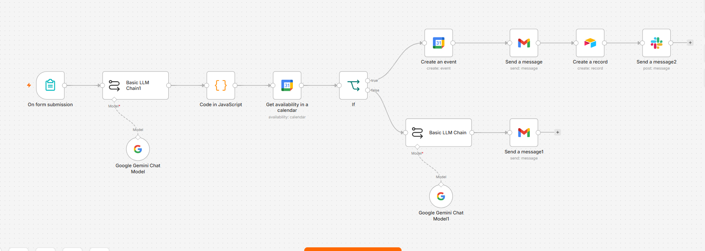
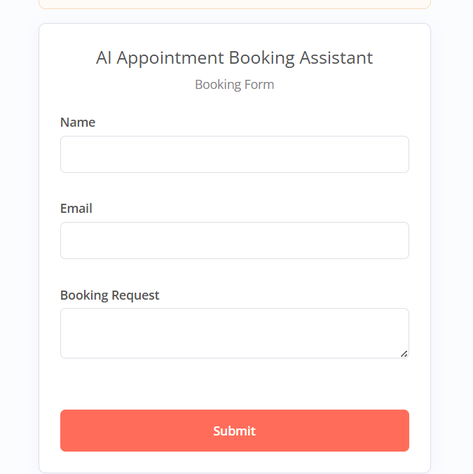
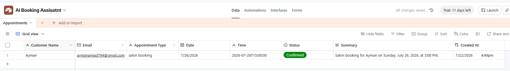
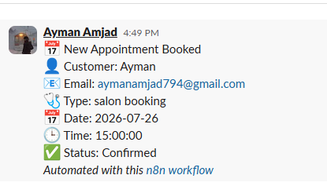

# 📅 AI Appointment Booking Assistant

An intelligent appointment booking system built with **n8n**, **Google Gemini**, **Google Calendar**, **Gmail**, **Airtable**, and **Slack**.

This workflow understands natural language appointment requests, checks calendar availability, creates bookings automatically, stores appointment data, and notifies both customers and the business.

---

## Features

- AI extracts appointment details from natural language
- Google Calendar availability checking
- Prevents double bookings
- Automatically creates calendar events
- Sends confirmation emails
- Stores bookings in Airtable
- Sends Slack notifications
- Handles unavailable appointment slots

---

## Tech Stack

- n8n
- Google Gemini
- Google Calendar API
- Gmail
- Airtable
- Slack

---

## Workflow

Form Submission
→ AI extracts appointment details
→ Check Google Calendar availability
→ If available:
    → Create Calendar Event
    → Send Confirmation Email
    → Save to Airtable
    → Notify Slack
Else:
    → AI generates an unavailable appointment email

---

## Business Value

Businesses can automate appointment scheduling without manually checking calendars or replying to customers.

This reduces:

- Manual work
- Double bookings
- Response time

---

## Screenshots

### Workflow

### Form

### Airtable

### Slack

---

## Future Improvements

- Suggest next available time slots
- WhatsApp integration
- SMS reminders
- Automatic rescheduling
- Zoom/Google Meet meeting creation

---

## Author

Ayman Amjad
